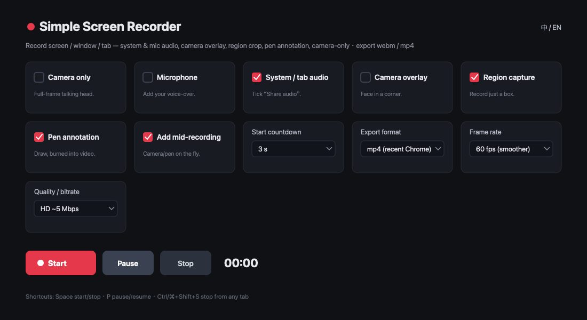

# 极简录屏 · Simple Screen Recorder（Chrome 扩展）

  

[English](#english) ·
一款**纯本地、零依赖、不联网**的 Chrome 屏幕录制扩展。一键录制 **整个屏幕 / 应用窗口 / 浏览器标签页**，可同时录系统声音与麦克风，叠加**摄像头画中画**（位置/大小/形状可调）、**框选区域**录制、**画笔标注**，也支持**仅录摄像头**口播，导出 `webm` 或 `mp4`，录完即时回放并下载。界面中英双语。

> 隐私：所有录制都在你本机完成，**不上传、不打点、不联网**；扩展也不含任何远程代码。

## 加载

1. 下载本目录，Chrome 打开 `chrome://extensions` → 右上「开发者模式」打开。
2. 「加载已解压的扩展程序」→ 选本目录。
3. 工具栏出现 🎬 图标。无需 `npm install`、无需编译。

## 使用

1. 点扩展图标 → 「打开录制台」（开成独立标签页，**关闭弹窗不影响录制**）。右上角可切 **中 / EN**。
2. 按需勾选：仅录摄像头 / 录麦克风 / 录系统声音 / 摄像头画中画（位置·大小·形状）/ 区域录制 / 画笔标注 / 录制中可加摄像头·画笔；选导出格式、帧率、码率、开始倒计时。**这些选项会被记住，下次自动恢复。**
3. 点 **开始录制** → 在系统选择器里挑屏幕 / 窗口 / 标签页。要录里面的声音，记得勾 **「分享音频 / Share audio」**。
4. **区域录制**：选源后录制台自动回到前台，在预览里拖拽框选；可**拖角调整、框内拖动**，点「确认并开始」只录这块（或「录整个画面」/「取消」）。
5. **画笔标注**：录制开始后出现工具条（画笔开关·5 色·粗细·撤销·清除），在预览里画线会**烧进录像**；画笔关时可正常查看预览。
6. **摄像头中途插拔**：录制中随时勾/取消「摄像头画中画」即时生效（需先勾「录制中可加摄像头/画笔」或本身已有叠加）。
7. 录制中可 **暂停 / 继续 / 停止**，或点 Chrome 自带的「停止共享」条自动收尾。
8. 停止后上方播放器变成可回放录像，点 **⬇ 下载录像** 保存。

### 快捷键

| 键 | 作用 | 生效范围 |
|---|---|---|
| 空格 | 开始 / 停止 | 录制台标签页聚焦时 |
| P | 暂停 / 继续 | 录制台标签页聚焦时 |
| Ctrl/⌘ + Shift + S | 停止录制 | **任意标签页**（全局） |
| Ctrl/⌘ + Shift + U | 暂停 / 继续 | **任意标签页**（全局） |

## 设计要点

- 录制跑在独立扩展页面 `recorder.html`，而非 popup——popup 关闭会立刻中断 `getDisplayMedia`。
- **合成管线**：有叠加需求（摄像头/区域/画笔/中途叠加）时把画面（按需裁剪）+ 摄像头 + 画笔重绘到 `<canvas>` 再 `captureStream()` 录制；**纯屏幕无叠加时走直通流**最省资源。`canvas` 宽高取偶数（兼容 H.264），尺寸 = 源/裁剪分辨率，像素不缩水。
- **后台不卡**：录屏时录制台在后台，`rAF`/`setInterval` 被节流到 ~1fps，故用 **Web Worker 定时器** 驱动每帧绘制（Worker 不受可见性节流）。
- **画笔**：预览上叠透明 `drawSurface` 接收指针、即时反馈；已完成描线缓存到离屏 canvas，每帧只画当前一笔，标注多也不卡。受架构限制（扩展拿不到被录标签页句柄），画笔画在录制台预览上、烧进录像，并非注入被录页面。
- **音频**：系统音 + 麦克风用 `AudioContext` 混成一条轨；只有一个来源时直接用那条。
- **mp4**：新版 Chrome 的 `MediaRecorder` 原生支持录 mp4（H.264），特性检测不支持时自动回退 webm 并提示。
- **全局停止**：`background.js`（service worker）监听快捷键，转发停止/暂停给录制台标签页，让你在任意标签页都能停。

## 文件

| 文件 | 作用 |
|---|---|
| `manifest.json` | MV3 清单，权限仅 `tabs` + `storage` |
| `popup.html / popup.js` | 工具栏弹窗，打开/聚焦录制台 |
| `recorder.html / recorder.js` | 录制台：选源、合成、录制、画笔、预览、下载 |
| `background.js` | 全局快捷键转发 |
| `i18n.js` | 中英文案字典与切换 |
| `icons/` | 16/48/128 图标 |

## 说明 / 限制

- 受 DRM 保护的内容（部分流媒体）画面会黑屏，是浏览器层面的保护，属正常。
- macOS 首次录整屏需在「系统设置 → 隐私与安全性 → 屏幕录制」给 Chrome 授权；用摄像头/麦克风也会弹一次权限。
- 共享「应用窗口」时通常没有系统声音（浏览器限制），整屏/标签页才有。
- 录像在停止前**暂存在内存**，超长/超大录制（>3GB 或 >60min）会提示，建议分多段。
- 旧 Chrome 不支持录 mp4 时回退 webm，可用 ffmpeg 转：`ffmpeg -i in.webm out.mp4`。

## 贡献 / 二次开发

纯静态扩展，改完代码在 `chrome://extensions` 点扩展卡片的刷新即可生效，无需构建。欢迎 issue / PR。

上架 Chrome 应用商店（可选）：需一次性 5 美元开发者注册费 + 审核；打包时把本目录压成 zip 上传即可。不上架也能用「加载已解压的扩展程序」。

## License

[MIT](LICENSE) © 2026 wangshasha

---

## English

A **fully local, zero-dependency, offline** Chrome screen recorder. Record the **whole screen / a window / a browser tab**, with system + microphone audio, an adjustable **camera picture-in-picture** (position/size/shape), **region capture**, **pen annotation**, and a **camera-only** mode. Export `webm` or `mp4`, replay and download instantly. Bilingual UI (中文 / English).

> Privacy: everything is recorded **on your machine** — nothing is uploaded, tracked, or sent anywhere, and the extension bundles no remote code.

**Load it:** open `chrome://extensions`, enable Developer mode, click *Load unpacked*, pick this folder. No build step.

**Use it:** click the 🎬 icon → *Open recorder* (a dedicated tab — closing the popup won't stop a recording). Toggle the options you want (they're remembered), hit *Start*, pick a source (tick *Share audio* for sound). Region capture lets you drag/resize a box; pen annotation is burned into the video; stop from any tab with **Ctrl/⌘+Shift+S**.

**Shortcuts:** Space start/stop · P pause · Ctrl/⌘+Shift+S stop (global) · Ctrl/⌘+Shift+U pause (global).

**Notes:** DRM-protected content records black (browser protection); window shares usually have no system audio; the recording is held in memory until you stop (a warning shows past ~3 GB / 60 min); old Chrome without mp4 support falls back to webm (`ffmpeg -i in.webm out.mp4`).

**License:** [MIT](LICENSE) © 2026 wangshasha
